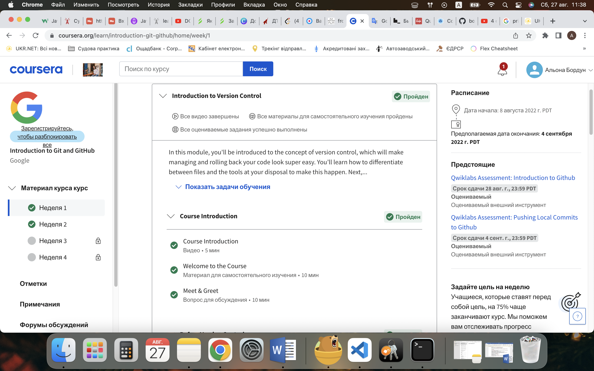

# kottans-frontend
### About me
Hello Kottans! :raising_hand_woman: My name is Alyona and I've decided to learn frontend-development with this amazing course "Kottans frontend":woman_technologist: :books:

### Stage 0. Self-Study

:pushpin: __General__

- [x] [Git Basics](#git-basics)
    - Course: Version Control with Git

screenshots

- [ ] **1.** [Linux CLI and Networking](#linux-cli-and-http)
    - Course: Linux Survival
    - Article: HTTP: The Protocol Every Web Developer Must Know - Part 1
    - Article: HTTP: The Protocol Every Web Developer Must Know - Part 2
- [ ] **2.** [VCS (hello gitty), GitHub and Collaboration](#git-collaboration)
    - Course: GitHub & Collaboration
    - Course: Learn Git branching (last levels)
**Front-End Basics**
- [ ] **3.** [Intro to HTML & CSS](#intro-to-html-and-css)
    - Course: Intro to HTML & CSS (Udasity)
    - Course: Learn HTML(Codeacademy)
    - Course: Learn CSS(Codeacademy)
- [ ] **4.** [Responsive Web Design](#responsive-web-design)
    - Course: Responsive Web Design Fundamentals
    - Game: Flexbox froggy
- [ ] **5.** [HTML & CSS Practice]()
- [ ] **6.** [JavaScript Basics]()
- [ ] **7.** [Document Object Model]() - practice
**Advanced Topics**
- [ ] **8.** [Building a Tiny JS World (pre-OOP)]() - practice
- [ ] **9.** [Object oriented JS]() - practice
- [ ] **10.** [OOP exercise]() - practice
- [ ] **11.** [Offline Web Applications]()
- [ ] **12.** [Memory pair game]() — real project!
- [ ] **13.** [Website Performance Optimization]()
- [ ] **14.** [Friends App]() - real project!
---

