# kottans-frontend
# About me
Hello Kottans! :raising_hand_woman: My name is Alyona and I've decided to learn frontend-development with this amazing course "Kottans frontend":woman_technologist: :books: I will do my best to achieve results. Thanks for opportunity.

## Stage 0. Self-Study

:pushpin: __GENERAL__

### 1. Git Basics
- [x] 1.1. Course: Version Control with Git
 

    
Screenshots

       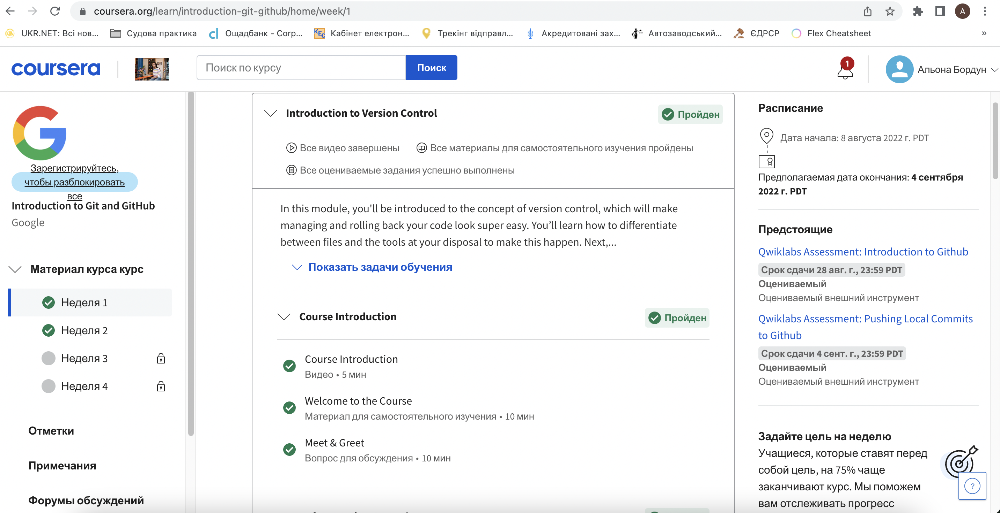
       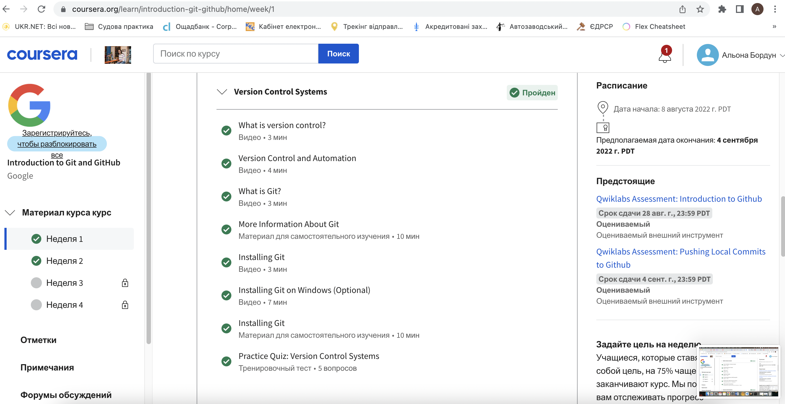
       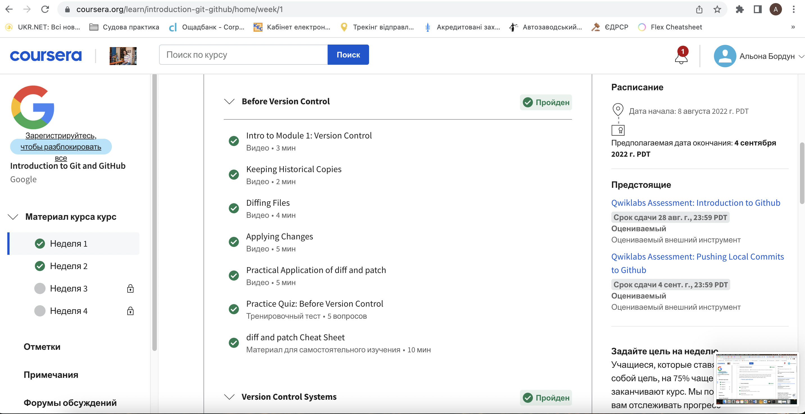
       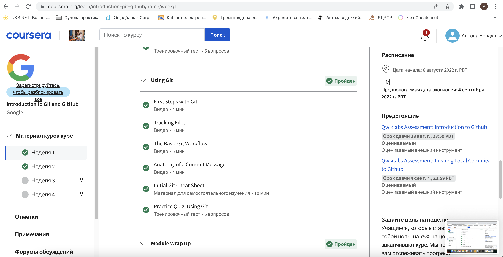
       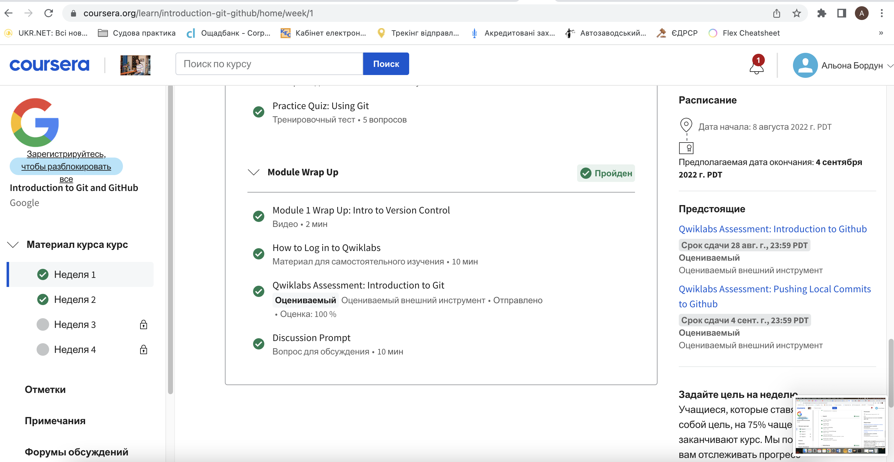
       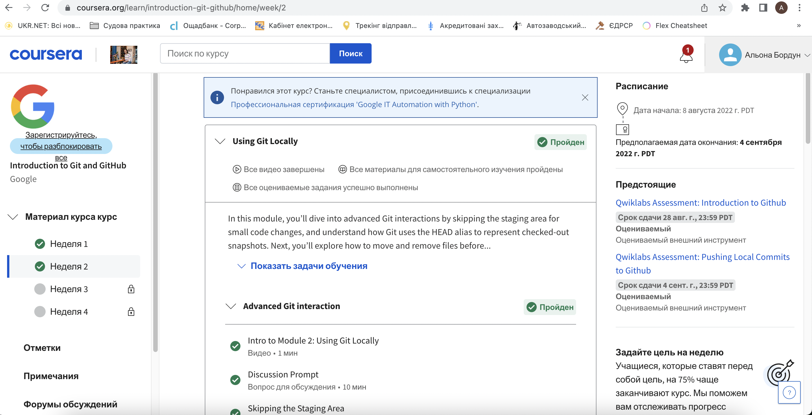
       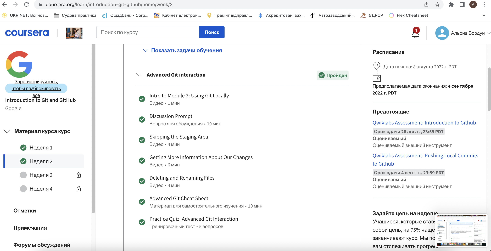
       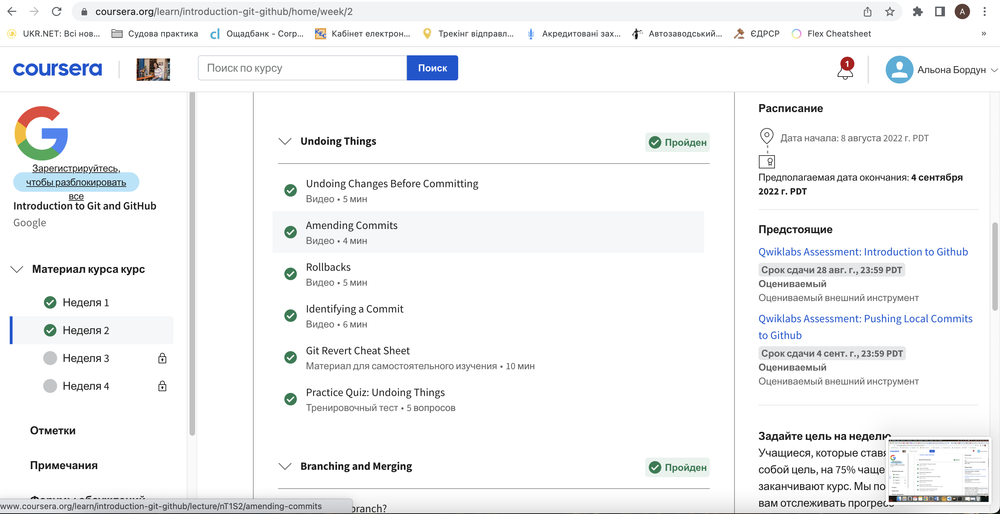
       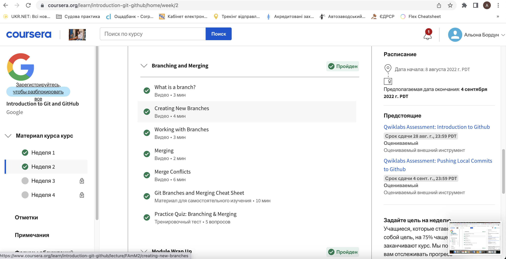
       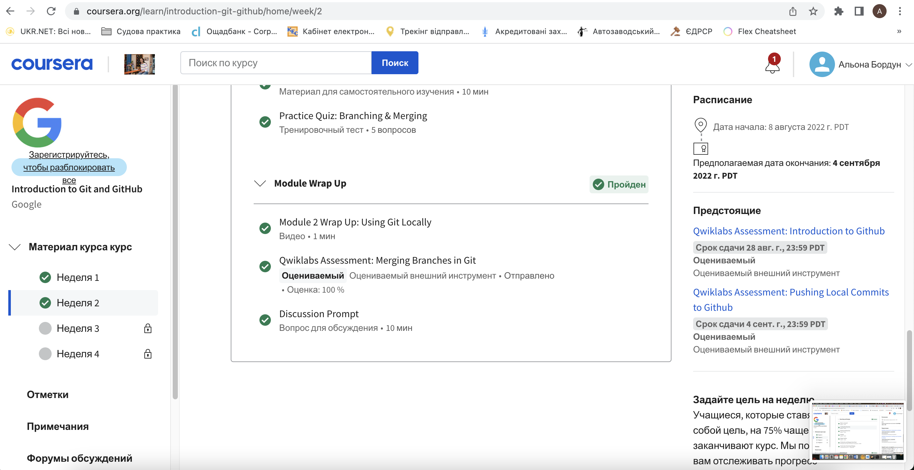
    

    
- [x] 1.2. Course: LearnGitBranching

    
Screenshots

      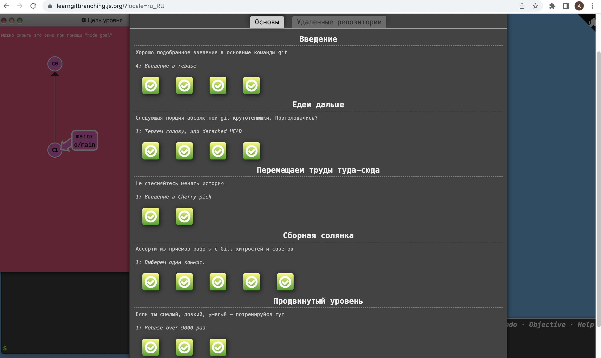
      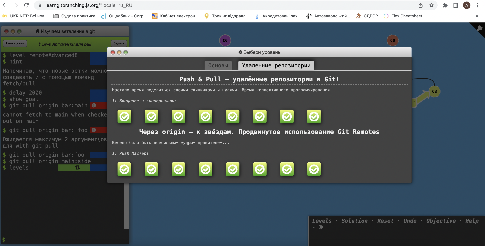

__My conclusions__:
     
 I would like to share my thoughts, impressions about learning material about git, Github. 

I’ve learned following new commands for me: __git reset__ and __git revert__. I understood the differences between them, I understood that git reset is designed to actually rewrite history, it actually deletes the committed commit and takes us to the last commit. In turn, git revert essentially creates a new commit with the reversed changes.  

Also new was the command __git commit –amend__ – for editing a comment in a commit; __git checkout -b new branch__ – to create a new branch, assign it a name and switch to it; __git branch -d new branch__ – delete a branch.

 New for me were - the ways of moving along the branch with <strong>^ - carriage</strong>, <strong>~ - tilde</strong>.

The most surprising (I can say I fell in love with it :heart_eyes:) were <strong>git rebase</strong>:heart:, <strong>git rebase -i</strong>:yellow_heart: and <strong>git cherry-pick</strong>:two_hearts:. I will definitely use them at work. I enjoyed working with these commands on the learnGitBranching course. 

The __git fetch__ and __git pull__ commands were also new. I learned that actually git pull is a combination of git fetch and git merge commands. In addition, a new  for me was git fakeTeamWork.  

Thank you for the opportunity to practice well, even in game form. I made a workbook with conspectus
:pencil:, described the commands I had passed and studied. I will try to use them all in my work.  

In addition, I am learning __Markdown__ for myself, since I have not worked with such a markup language before.

And, I advise to go through additional materials together with the main material, and not postpone it for later, because you can also find something useful for yourself. 

Thank you, I will continue...:woman_technologist:

---

### 2. [Linux CLI and, HTTP](#linux-cli-and-http)
- [x] 2.1. Course: Linux Survival

    
Screenshots

      
      
      
      
      
      
      
      

 I want to say a few words about the course <b>Linux Survival (4 modules)</b> :+1: 

I’ve got knowledge of basic commands in Linux such as: __«ls», «mkdir», «rmdir», «cd», «more», «pwd», «mv», «rm», «cp»__.

 New for me was that the <b>«rmdir»</b> command can only remove an empty directory. The commands: <b>«more», «pwd», «cp»</b> were unknown for me before 

In module 2, I've learned about how provided the access with some actions in files of directory. I’ve learned  the <b>«chmod»</b> command. I’ve learned about the possibility to select all files in a directory using <b>«*»</b> or  e.g. files with -ing ending - <b>«ls *ing»</b> and so on.

The third module was the most difficult.:disappointed_relieved: I got knowledges about moving between files in the directory. How to get to the home folder, how to indicate that you are in the current folder. The <b>«find»</b> command was surprising. Quite useful and convenient thing, I will definitely use it at work.:+1:

The command <b>«cat» and «>» and «>>»</b> were new to me. Separately, I enjoyed the commands related to printing files. It was quite clear for me such as: <b>«lpr» (send to print), «lpq» (show the print queue), «lprm» (delete a file from printing).</b> I’ve learned how to bind with some printer through the command line.

In module 4, the <b>«kill»</b> command and the tougher <b>«kill -9»</b>  - for forced removal were the most surprising.

In addition, the <b>«df»</b> command was new to get understanding how much space is left in the directory. I learned how to copy files from someone else's directory to my own using <b>«cp -r»</b>, and how to delete a directory with files using <b>«rm -r»</b>. New to me was the command called <b>«ps»</b> that checks the status of the program and the technical mark <b>«|»</b>. In addition, the <b>«grep»</b> command for finding every repetition of a word in a file was interesting for me.:+1::+1:
 

I believe that knowledge of Linux system commands will be quite necessary and useful in work :woman_technologist:

---

- [x] 2.2. <b><ins>Article: HTTP: The Protocol Every Web Developer Must Know - Part 1</ins></b> 

In Article №1, I’ve learned that <b>HTTP</b> is a special protocol for delivering a document to a Web browser by a Web server. :computer::globe_with_meridians: Also <b>TCP (Transmission Control Protocol)</b> is used as the transport protocol. 

What was new to me and what surprised me that the HTTP protocol is considered as stateless protocol, that why, it does not store information about the user's session; each data transfer is considered as a new session.

I also learned about the current version of this protocol, which is used nowadays, namely <b>HTTP/1.1</b> 

I’ve studied the structure of a URL, which consists of :one:protocol, :two:host, 	:three:port, 	:four:resource path, and :five:request.

I learned about the most frequently used <b>«GET»</b> request method and about other methods such as <b>POST, PUT, DELETE</b> etc.

Totally new to me were the numerical responses from the server, some of them were known, like <b>200 OK</b> and <b>404 Not Found.</b> But the group of <b>301, 303 about moving the address, 401 about the need for authentication, 403 (denied access to the resource), 500 (internal server error), 503 about the impossibility of processing requests by the server for technical reasons or overload</b>, and others - were completely new to me.

Having gained knowledge about these types of responses, I can now easily apply them in my future work.

I learned about the availability of libraries and frameworks such as ExpressJS (for Node), Ruby on Rails and jQuery Ajax.

---

- [x] 2.3. <b><ins>Article: HTTP: The Protocol Every Web Developer Must Know - Part 2</ins></b>

In Article №2,  interesting and new to me was that a frontend developer must have knowledge about server client <b>identification and authentication.</b> This goal is to track site or app traffic and regular user behavior patterns. I will use the acquired knowledge in the future.

In addition, it was new to me that there are several ways to get information about the user from the server, through <b>IP address, request headers, cookies:cookie: etc.</b> I’ve learned that cookies are the most popular and unobtrusive files, because it is necessary to get the user's prior approval for their use.

What surprised me was that HTTP with a secure connection is currently being used, namely HTTP<b><i><ins>S</ins></i></b> - <b>HTTP <i><ins>Secure.</ins></i></b> I checked my browser's own address bar and found <u>HTTPS protocol</u> there.:+1:

---

### 3. [VCS (hello gitty), GitHub and Collaboration](#git-collaboration)
- [x] 3.1. <b><ins>Course: GitHub & Collaboration</ins></b>

    
Screenshots

       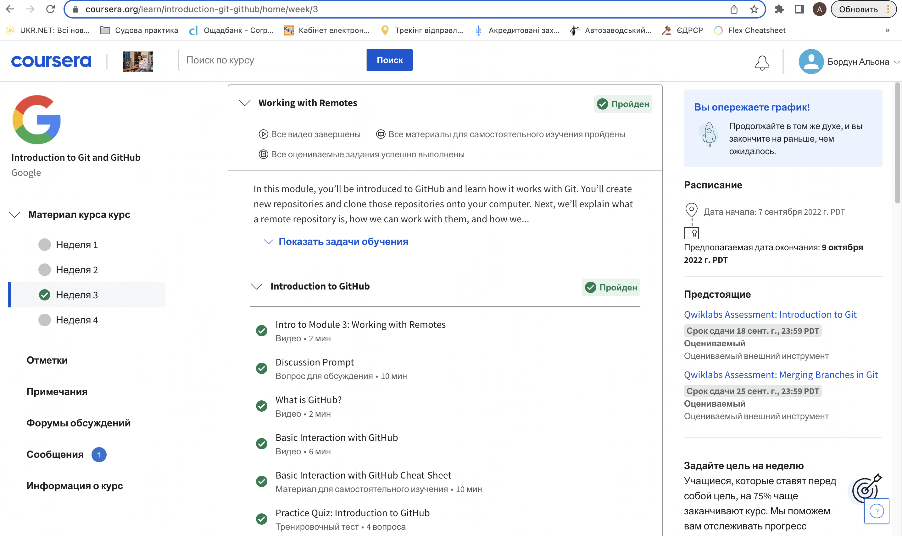
       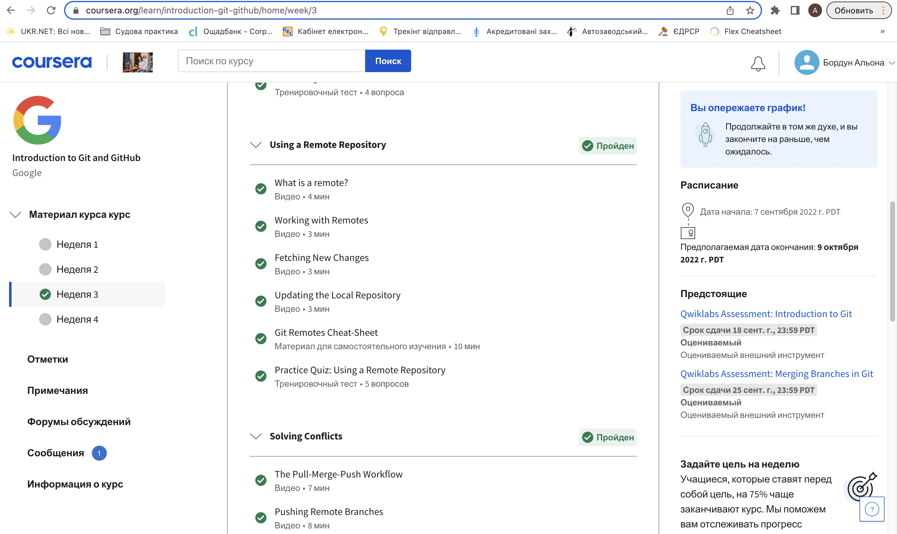
       
       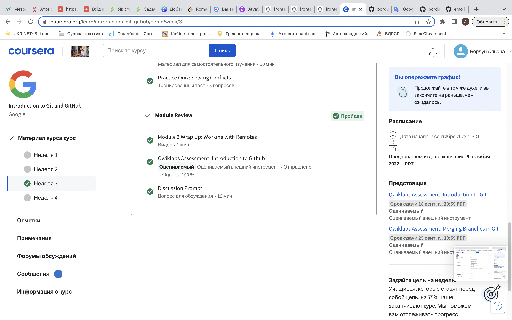
       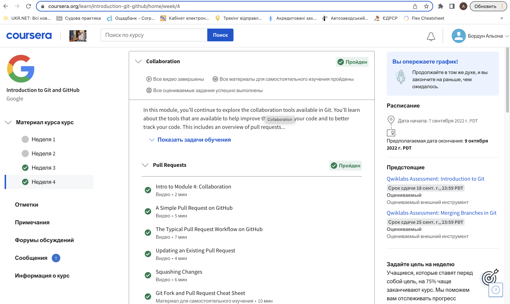
       
       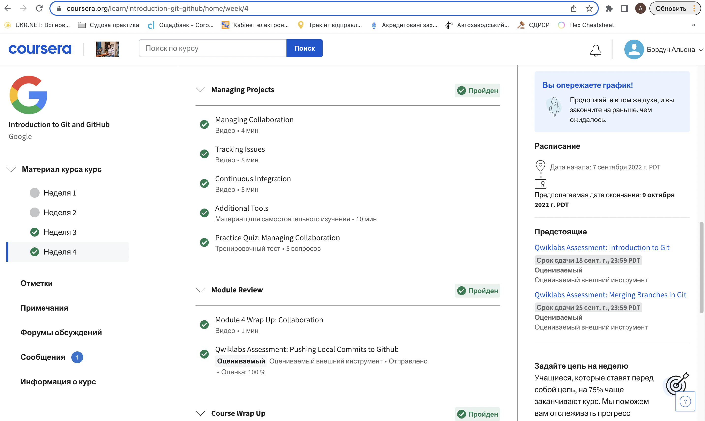
       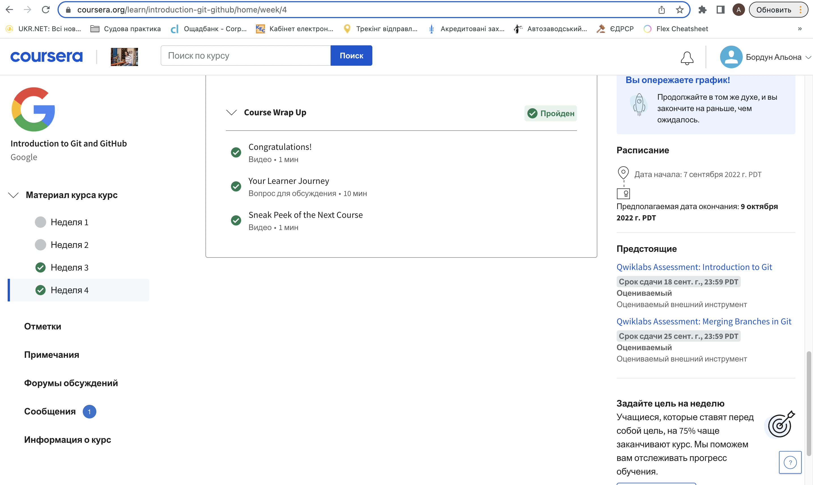
    

 After listening to Weeks 3 and 4 of the Coursera: Introduction to Git and GitHub course, I've got knowledge about <b>Squash and Fixup</b> when rebasing. I’ve learned that squash merges commit messages into one. Fixup discards the new commit message. The fixup operation will preserve the original message and discard the messages from the fixup commit, while squash will merge them. 

What really turned out to be interesting and really surprised is the topic about <b><i>Reviewing the code</i></b> and taking into account the comments of other developers.
I will definitely communicate with other developers in my future work and always appreciate their comments.

I've learned about common code issues that might be addressed in a code review such as:
 
  * Using unclear names;
  * Forgetting to add tests;
  * Forgetting to handle a specific condition.

 

<b><ins>I've learned that the goals of code review are:</b></ins>
 
 
 :one: Make sure that contents are easy to understand;

 
 :two: Ensure consistent styles;

 
 :three: Ensure we don't forget any important cases.

- [x] <b><ins>3.2. Course: Learn Git branching (last levels)</b></ins>

    
Screenshots

      
      

    
 About learnGitBranching course topics: <b><i>Basics: Moving work back and forth and Remote repositories: Through origin - to the stars. Progressive use of Git Remotes</i></b>

I want to say that when I was learning Git Basic, I was so fascinated by learning with the learnGitBranching-course so I <ins>passed through all the topics of this course.</ins> Therefore, I will simply duplicate the screenshots here (..Ohh..And I think: Why almost everything is super clear to me in 3 and 4 weeks of Coursera :sweat_smile:)

 
 ---
 
:pushpin: __FRONT-END BASICS__
### 1. [Intro to HTML & CSS](#intro-to-html-and-css)
- [x] 1.1. <b><ins>Course: Intro to HTML & CSS (Coursera)</ins></b>

    
Screenshots

      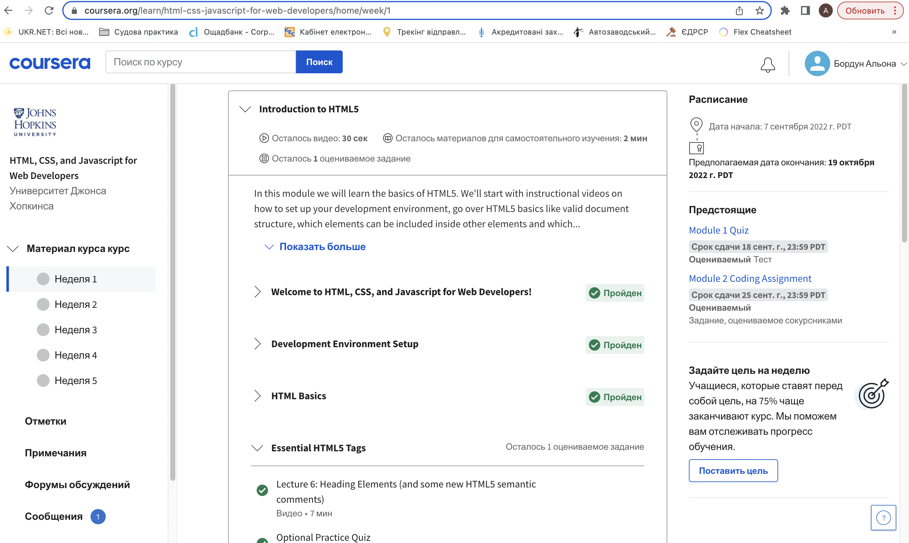
      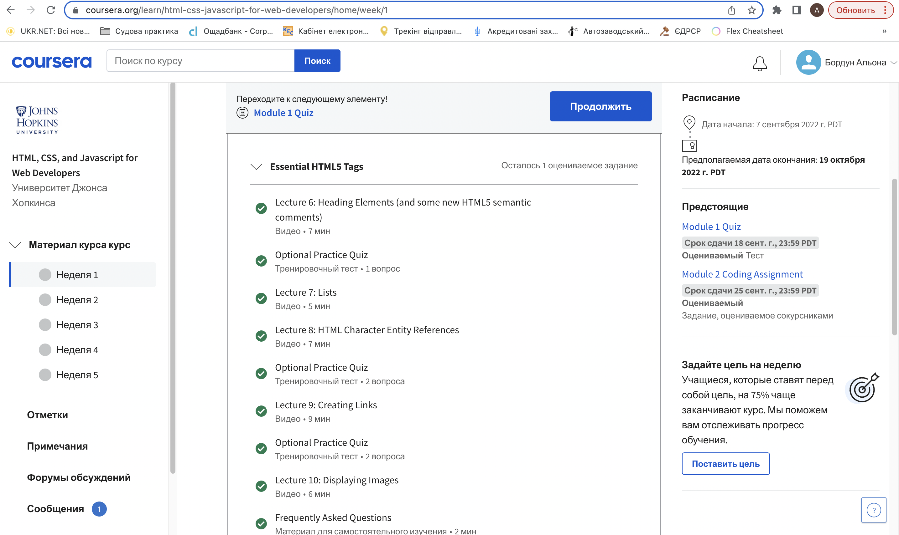
      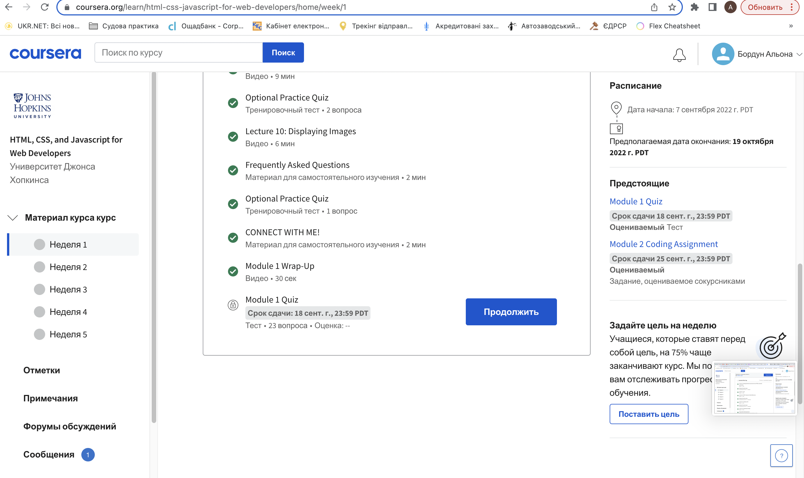
      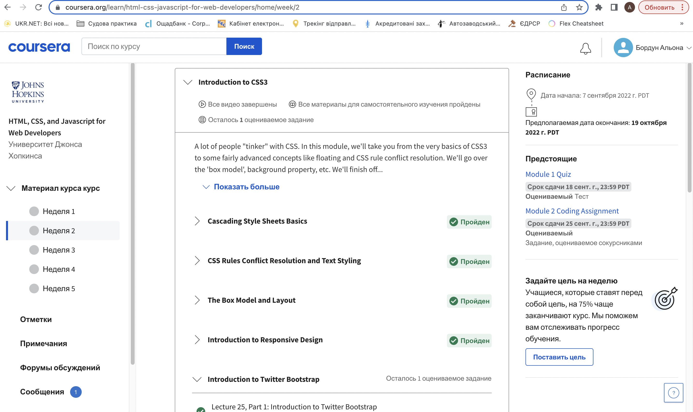
      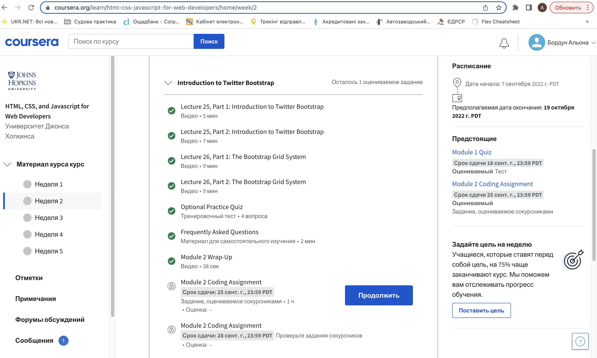

    
   :star: My impressions: :star:
    
Throughout this course I've learned that the core purpose of HTML is to <b><i>Communicate the structure of the content, because HTML defines content structure.</i></b> I've learned about the new for me site https://caniuse.com/ that explains which HTML-attribute can be used in a specific browser version. I will use it in my future work. I've learned about <i>meta tags</i>, why they are needed(e.g. to communicate information TO THE BROWSER); learned about new for me Quirks Mode.

    
 In CSS-course I've learned a new for me information about how reset default values of the browser (to set margin: 0; padding: 0 in body section in style.css file). The most interesting and surprizing topic for me was <b><ins>«relative and absolute position»</ins></b>. I will definitely use this knowledge in work. 
 
    
 Really enjoyed the lectures about <b>Media queries, Bootstrap and Grids</b> :fire::fire:

   
 - [x] 1.2. <b>Course:<ins>Learn HTML + CSS</ins>(Codeacademy)</b>
 
 

    
Screenshots

      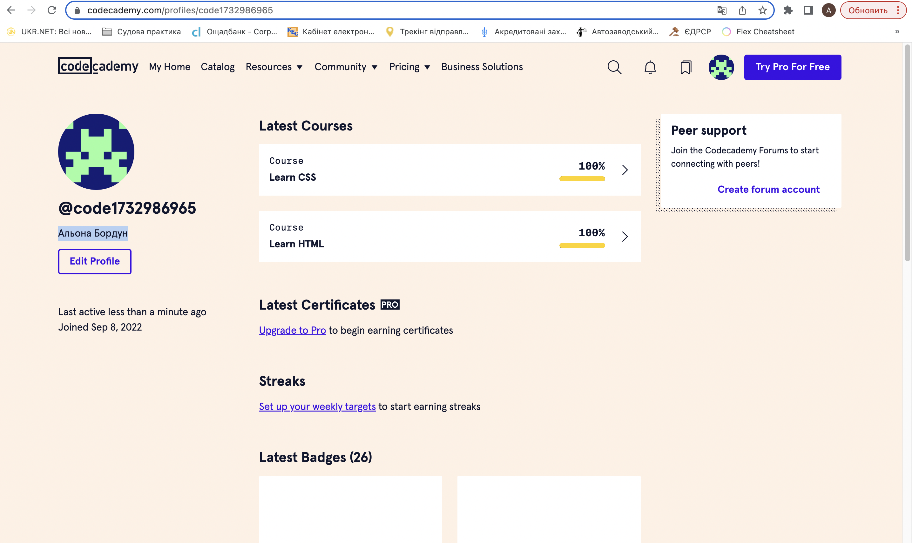

This course was also interesting and enjoying. The Codeacademy-sandbox was a little buggy and dangling, but OK! New for me was <b>«forms-topic»</b> and that the value of id-attribute (identificator) in input must match with label for-attribute. And when we want to limit usernames-form to only letters and numbers (and not special characters like ! or @) we can add a pattern attribute and set it to: «[a-zA-Z0-9]+». Thanks!:+1:

***

### 2. [Responsive Web Design](#responsive-web-design)
  - [x] 2.1. <b><ins>Course: Responsive Web Design Fundamentals. Games: Flexbox Frogy, Grid Garden</ins></b>
 

 80% of the material about responsive web design was new for me :white_check_mark:

From the Responsive Web Design article, I gained new knowledge about what <b><ins>«initial-scale=1»</ins></b> is (allowing browsers to set a 1:1 ratio between CSS pixels and hardware-independent pixels, regardless of device orientation , which allows the page to use the entire width of landscape orientation)
 The value of the viewport meta tag <b><ins>«width=device-width»</ins></b> tells the page to match the width of the screen. The <b><ins>«viewport»</ins></b> meta tag gives the browser instructions for controlling the dimensions and scaling of the page.

Now  I understand what these values created for, I can easily use them at work. What surprised me in the article was that, apart from the meaning
initial-scale , you can also set the following viewport attributes:  
:green_circle: minimum-scale  
:large_blue_circle: maximum-scale  
	:yellow_circle: user-scalable  

When used these attributes, the user may not be able to change the scale of the viewing area, which may cause accessibility problems. Therefore, the authors do not recommend using these attributes.

In addition, what was new was that, as a rule, the Image has fixed dimensions, and if they exceed the dimensions of the viewing area, then this leads to the appearance of a scroll bar. A common way to solve this problem is to set the max-width property to 100% for all images. I will use this in my future work.

I really liked Zheka's videos. I taught layout on my own several times based on his videos. He tells a lot of convenient and useful features at work. He spoke in more detail about the properties of flexbox, flex items, grid, etc.I will repeatedly return to him in my work.
 

Really liked the Flexbox Froggy :frog: and Grid Garden games:carrot:

These games helped to learn the properties of flexbox and grid, to understand how they work in practice. The Grid Garden game from level 24 was difficult for me, I was surprised by the unit of measurement <b>«fr»</b> and the fact that it can be combined with <b>«%»</b> and <b>«px»</b>.

 

    
Screenshots

      
      

Thank you for offering to study only relevant, necessary and really useful material:+1::+1:

***
    
### 3. [HTML & CSS Practice]()

    - [x] 3.1. Hooli-style Popup

[Demo](https://bordun2022.github.io/taskPopup/) |
[Code base](https://github.com/bordun2022/taskPopup)

It was a novelty to work with grids and flexes and media queries. I will use this knowledge in my work. Improved the skills of using the console in Google Chrome.
  

I learned new properties of flex, previously unknown.  
It was amazing how wonderfully the blocks of code cooperated with each other.

***   
    
### 4. [JavaScript Basics]()

    - [x] Coursera - Introduction to Javascript:
    
    

    
Screenshots

      
      

    

In Courser's course of JS, I learned that the value <b>«Undefined»</b> in JavaScript has a specific meaning, and its meaning is that it was declared or defined, but it <b>was not set to any value.</b> 
In turn, <b>«null»</b> is the absence of any value at all.

I was surprised by the topic of copying primitives and objects. I didn't know that if we change the value of the object in the copy, the value in the original value will also change. 
In turn, if we change the original value in the primitive, the copy of the primitive will remain the previous one. It is really interesting and will be useful for me in my work.

The themes of prototypes and closure were generally new. I think it will be 100% useful at work.

### 5. [Document Object Model]() - practice
    - [ ] 5.1. Frontend основи про DOM API
    - [ ] 5.2. Практичне завдання 
    
:pushpin: __ADVANCED TOPICS__
### 1. [Building a Tiny JS World (pre-OOP)]() - practice
    - [ ] 1.1. Building a Tiny JS World - завдання
### 2. [Object oriented JS]() - practice
### 3. [OOP exercise]() - practice
### 4. [Offline Web Applications]()
### 5. [Memory pair game]() — real project!
### 6. [Website Performance Optimization]()
### 7. [Friends App]() - real project!

